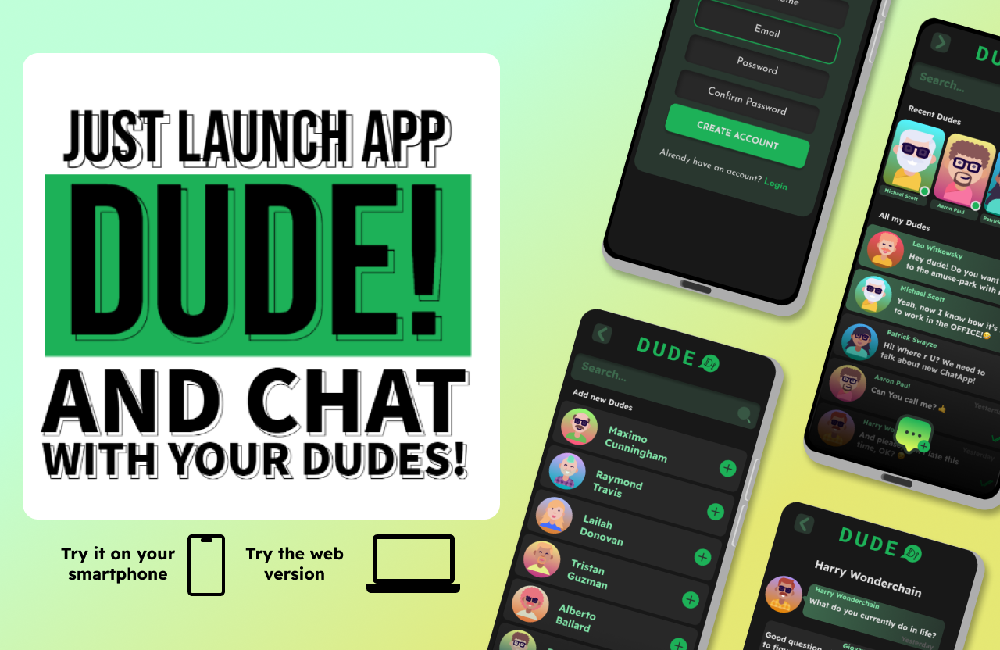
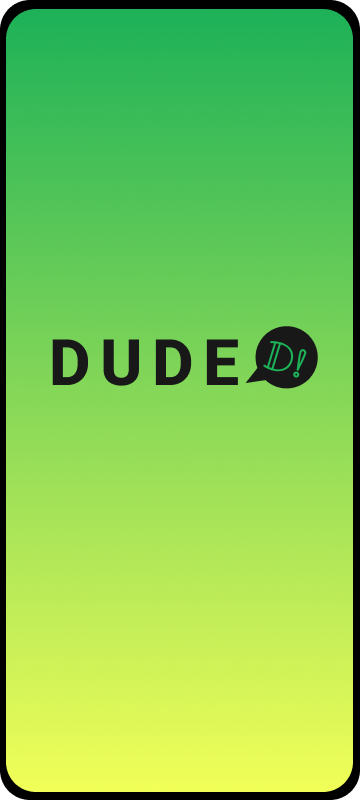
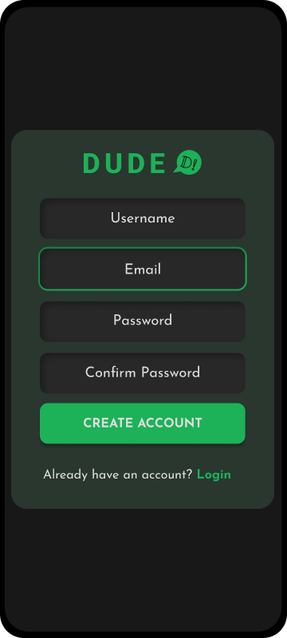
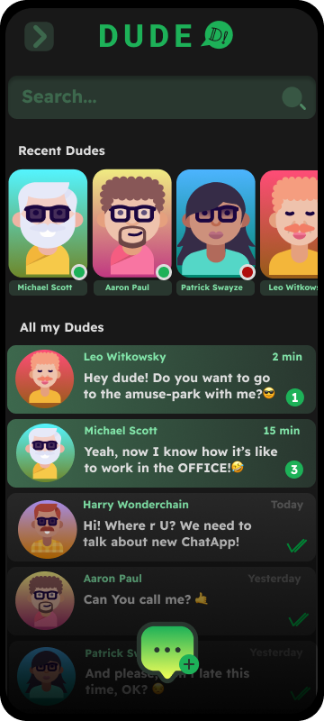
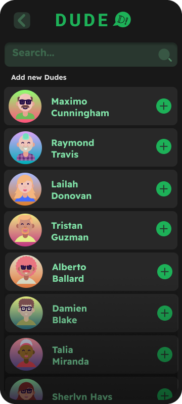
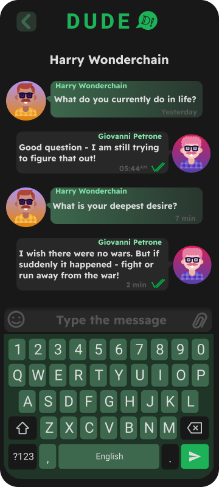
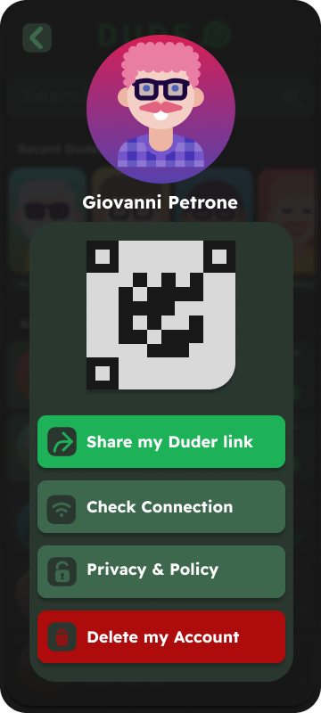

# DUDE!

## **A simple chat application with encryption features.**

### This project was a simple implementation of the idea of a secure web application for communication. The next thing was the idea to make a closed chat for the [LGBT community](https://www.google.com/search?client=firefox-b-d&q=+LGBT+community).

### But, over time, it acquires new features and grows into a full-fledged secure chat application

## Main tools used:
1) HTML DOM;
2) JavaScript;
3) REACT app building;
4) NODE server creating;
5) MongoDB a DataBase management;
6) yarn requests and commnds;

**During the development of this project, I managed to familiarize myself with:**
>- basic principles of working with versions;
>- establishing communication between the client and server part;
>- working with JavaScript hooks;
>- application of stylization of text input forms;
>- adding various decorative functionality;

and the work continues.

## Development led me to learn the basics of design using Figma.
As you can see, the main idea is to create an adaptive design that will work correctly on different devices.
This is how, for example, the application will look on smartphones:

1. This is DUDE! Startup loading screen. I don't think that such a bright screen will quickly get boring to see on slow devices.

2. This is DUDE! Log-in screen. Everything is very simple:
- nickname;
- working e-mail;
- password

3. This, in my opinion, will be a convenient Main menu of the application. The design is minimalist, functional:
- quick search;
- fixed list of selected or recent dudes;
- a list of all conversations with unread messages pinned above.

4. But with adding dudes for communication, there is a problem. To add a new contact, you need to search for it among existing users of the application. So far, the server works only through the registration form and thus registers new participants.
I want to add functionality:
- registration by phone number;
- registration using social networks;
- synchronization of the contact book for quick addition to the application list.

5. As for rooms for chatting with dudes - everything is clear here.
The only thing is that I still can't implement adding files.

6. The concept of the About screen is very interesting. I decided to display the generated personal Keycode at once for quick sharing of my chat account.
From this screen, you can also check the security of your connection and delete your account with a complete erasure of all your conversations with everyone and delete your messages in their accounts as well.

### You can familiarize yourself with the results of the concept by following this link to [the project](https://www.figma.com/proto/Q0zR8dOBhrpiDEDFKoIegi/DUDE---D!---ChatApp?page-id=35%3A14547&node-id=35-15775&viewport=1934%2C-484%2C1.22&t=NIQM8Vm6BdnBAKCC-1&scaling=scale-down&starting-point-node-id=35%3A15775).
